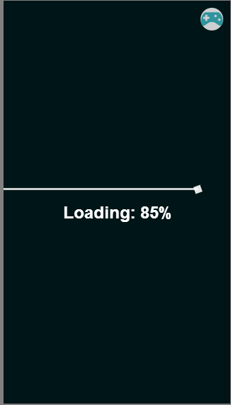
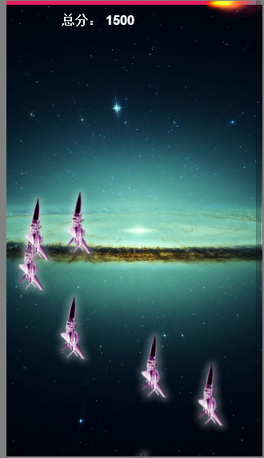

<h1>CreateJS Demo</h1>

	这是一个使用CreateJS创建的HTML5游戏实例，意义在于学习使用CreateJS

	之间使用到了一些游戏方面的工具： 
	1. 一个非常制作粒子效果的工具 <a href="http://www.wondertouch.com/index_2.asp" target="_blank">Particles Illusion</a> 
	2. 一个制作Sprite图的工具 <a href="https://github.com/wuqiang1985/sprite" target="_blank">Sprite</a> 
	在项目的tools中已经存放了所使用的工具 

	
	
	

